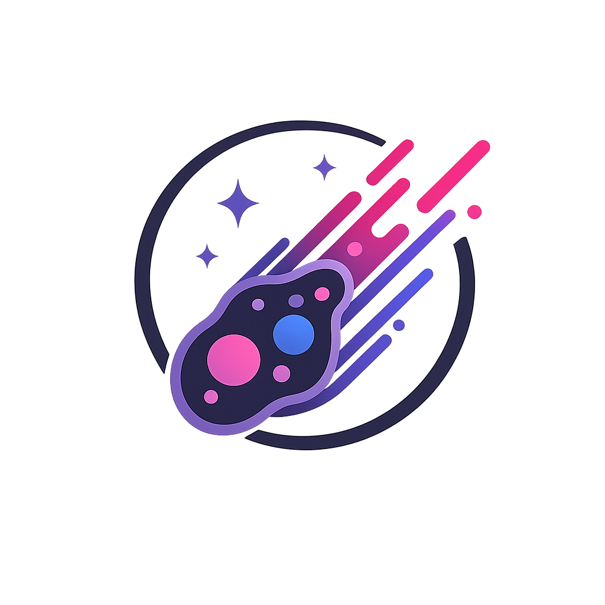

<div align="center">



# Taumoeba.io WebKit

**A blazing-fast, zero-dependency developer toolkit that lives entirely in your browser.**

JWT decoding · JSON editing · JSON serialize/deserialize · Base64 · URL encoding — all in one beautiful static page.

<br/>

[](https://taumoeba.io)

<br/>

[](.)
[](.)
[](.)
[](.)
[](.)

</div>

---

## What is this?

Taumoeba.io WebKit is a collection of everyday developer utilities packaged as a single, self-contained HTML file. No npm install. No bundler. No runtime. Open it in a browser and it works — locally, offline, or served from any static host.

The design is inspired by [Catppuccin](https://github.com/catppuccin/catppuccin) — a pastel palette that's easy on the eyes at 2 AM and just as clean in full daylight.

---

## Tools

### 🔐 JWT Decoder
Paste any JWT and watch it come alive. The encoded token lights up in three distinct colors — **header · payload · signature** — right inside the input box. Click it to edit, click away to decode.

- Structured claim table with type-colored values (strings, numbers, booleans, arrays)
- Human-readable timestamps with live relative time (`expires in 3h`, `issued 2m ago`)
- **PingOne-aware** — automatically annotates `env`, `org`, `p1.app`, `p1.region`, `acr`, `amr`, `sid`, and more
- Expiry badge: `Valid` · `Expired` · `Expires in Xm` · `Not Yet Valid`
- Algorithm and token-type badges
- One-click copy for header and payload

### 🌲 JSON Editor
A split-pane editor with two sub-tools: **Editor** and **Serialize / Deserialize**.

#### Editor
- **Left pane** — raw text editor with auto-parse on type
- **Right pane** — collapsible tree view with ▾/▸ toggles and item counts on collapsed nodes
- Type-colored values throughout (`teal keys`, `green strings`, `peach numbers`, `mauve booleans`, `sky nulls`)
- Format · Minify · Sort Keys — all non-destructive
- Live validation status chip with node count
- Explicit sync arrows to push text → tree or tree → text

#### Serialize / Deserialize
Convert between a JSON object and a JSON-encoded string literal — the operation you need when embedding JSON inside another JSON field, a config file, a REST body, or source code.

- **Serialize** — takes a JSON object and produces an escaped string literal: `{"a":1}` → `"{\"a\":1}"`
- **Deserialize** — takes a JSON string literal and expands it back to a formatted object: `"{\"a\":1}"` → `{ "a": 1 }`
- Swap input ↔ output in one click to chain operations
- Clear error messages when input doesn't match the expected form

### 🔡 Base64
Clean encode/decode with two variants and character count on output.

- **Standard** (`btoa` / `atob`) and **URL-safe** (`-_` instead of `+/`, no padding)
- UTF-8 and Latin-1 charset support
- Swap input ↔ output in one click

### 🔗 URL Encoder
Full percent-encoding in the two modes you actually need.

- **Component** — `encodeURIComponent`: encodes everything except `A–Z a–z 0–9 - _ . ! ~ * ' ( )`. Use for query values and path segments.
- **Full URI** — `encodeURI`: preserves URI structure characters (`: / ? # [ ] @ ! $ & ' ( ) * + , ; =`). Use when encoding a complete URL.
- Mode description updates inline so you always know what will be encoded.

---

## Design

| | Dark | Light |
|---|---|---|
| **Palette** | Catppuccin Mocha | Catppuccin Latte |
| **Base** | `#1e1e2e` | `#eff1f5` |
| **UI font** | Inter | Inter |
| **Code font** | JetBrains Mono | JetBrains Mono |

The color system lives entirely in CSS custom properties — swap a palette by editing one block of variables.

The header uses `backdrop-filter: blur` for a frosted-glass effect. Interactive states use `color-mix()` for alpha variants of semantic accent colors — no hardcoded `rgba` values anywhere.

The layout is fully responsive down to iPhone-sized screens: tab labels collapse to icon-only at narrow widths (accessible names preserved via `aria-label`), the JSON editor stacks vertically, inputs use 16 px to prevent iOS auto-zoom, and safe-area insets are respected for notch and home-indicator clearance.

---

## Getting Started

**Option 1 — just open it:**
```bash
open index.html   # macOS
start index.html  # Windows
xdg-open index.html  # Linux
```

**Option 2 — VS Code with F5:**

The repo ships a `.vscode/launch.json` with Chrome and Edge configurations. Hit **F5** and it opens directly.

**Option 3 — any static host:**

Drop the three files (`index.html`, `style.css`, `app.js`) anywhere — GitHub Pages, Netlify, Vercel, S3, a USB drive. No build step required.

---

## Deployment

Push to `main` and GitHub Actions handles the rest:

```
push → main
  └─ validate job
       ├─ JS parse check
       └─ asset presence check
  └─ deploy job (main only)
       └─ GitHub Pages via actions/deploy-pages
```

To enable: go to **Settings → Pages → Source → GitHub Actions**.

---

## Project Structure

```
taumoeba/
├── index.html          # all markup
├── style.css           # design system + components
├── app.js              # all logic
│
├── assets/
│   └── taumoeba-logo.png
│
├── .vscode/
│   └── launch.json     # F5 → Chrome or Edge
├── .github/
│   └── workflows/
│       └── deploy.yml
└── .gitignore
```

No `node_modules`. No `package.json`. No lock files. The entire app ships in hand-written HTML, CSS, and JavaScript — no build step, no bundler, no framework.

---

## Privacy

Most developer tools that run on someone else's server come with a hidden cost: **your data passes through their infrastructure.** Paste a JWT into the wrong tool and that token — along with its claims, scopes, and subject — lands in an access log somewhere. Paste sensitive JSON into an online formatter and it's in a request payload, potentially cached, indexed, or retained.

Taumoeba.io works differently:

- **No server receives your input.** There is no backend. The site is a static file served from GitHub Pages — when you paste a token or JSON, it never leaves your browser tab.
- **No logs exist to leak.** Because nothing is transmitted, there are no server-side audit trails, no access logs, no telemetry pipelines, and no third-party analytics touching your data.
- **The source is fully open.** Every line of HTML, CSS, and JavaScript is in this repository. You can read exactly what runs when you paste something. No minified black boxes, no bundled dependencies, no CDN-loaded scripts with opaque behavior. What you see is what executes.

This makes Taumoeba.io a tool developers can actually **trust** with real tokens and real data — not because you're taking anyone's word for it, but because you can verify it yourself.

---

## Philosophy

> Don't let the astrophage win.

In Andy Weir's *Project Hail Mary*, astrophage is a microorganism that latches onto stars and slowly drains their energy — imperceptible at first, catastrophic over time. A browser full of tabs does the same thing to a developer. Every tool that demands a sign-in, spins up a loading screen, phones home, or buries the feature you need behind a paywall is astrophage: quietly consuming the energy you meant to spend on the actual work.

Taumoeba.io is the antidote. Open it, use it, close it. No accounts. No onboarding. No latency. No tab that lingers. Your focus stays on the problem you were solving — not on the tool you opened to solve it.

---

<div align="center">


Made with the [Catppuccin](https://github.com/catppuccin/catppuccin) palette · Built for developers who live in terminals and dark mode

</div>
